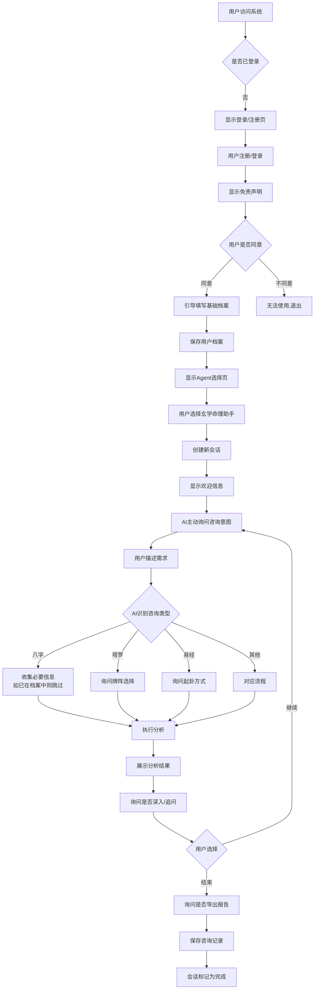

# AgentHub - 智能Agent平台 完整设计文档

> 版本: v1.0
> 更新时间: 2025-10-21
> 项目状态: 设计阶段

---

## 一、项目概述

### 1.1 项目定位
- **名称**: AgentHub (智能Agent平台)
- **类型**: 个人学习项目
- **目标用户**: 个人用户、小白用户
- **用户规模**: 50人以内
- **商业模式**: 免费,无会员体系

### 1.2 技术栈
- **后端**: C# + ASP.NET Core 8.0 + Semantic Kernel
- **数据库**: MySQL 8.0
- **AI服务**: 千问系列 (通过API)
- **向量数据库**: Qdrant/Milvus (用于RAG)
- **前端**: React 18 + TypeScript + Ant Design
- **实时通信**: SignalR (WebSocket)

### 1.3 核心特性
1. 多模式AI助手切换
2. 首期实现: 玄学命理助手 (全功能)
3. 后续扩展: 基金股票分析、健康医疗助手
4. 完整的用户画像和记忆系统
5. 流式对话输出
6. 工具集成能力 (插件化)
7. 管理后台和A/B测试

---

## 二、玄学命理助手功能架构

### 2.1 功能全景

```
玄学命理助手 (MVP = 完整功能)
├── 命理分析
│   ├── 八字命理
│   │   ├── 四柱排盘 (年月日时柱)
│   │   ├── 大运流年计算
│   │   ├── 十神分析 (正官、偏官、正财、偏财...)
│   │   ├── 格局判断 (正格、从格、化格)
│   │   ├── 喜用神分析
│   │   ├── 五行强弱分析
│   │   └── 流年运势预测
│   ├── 紫微斗数
│   │   ├── 命盘自动生成
│   │   ├── 十二宫分析 (命宫、兄弟宫、夫妻宫...)
│   │   ├── 星曜组合解读 (主星、辅星、煞星)
│   │   ├── 大限流年推算
│   │   ├── 命格判断 (紫府、武曲...)
│   │   └── 格局分析 (君臣庆会、财官双美...)
│   └── 生命灵数
│       ├── 生命数计算
│       ├── 天赋数分析
│       ├── 流年数预测
│       └── 数字能量解读
├── 占卜预测
│   ├── 易经占卜
│   │   ├── 六爻起卦 (手工、时间、数字)
│   │   ├── 梅花易数
│   │   ├── 64卦象详解
│   │   ├── 变卦分析
│   │   ├── 用神取用
│   │   └── 卦象综合解读
│   ├── 塔罗占卜
│   │   ├── 单张抽牌 (每日指引)
│   │   ├── 三张牌阵 (过去-现在-未来)
│   │   ├── 凯尔特十字 (全面分析)
│   │   ├── 关系牌阵
│   │   ├── 78张牌意详解
│   │   └── 正逆位解读
│   └── 占星预测
│       ├── 星盘自动生成 (需出生时地)
│       ├── 行星落宫分析
│       ├── 相位分析 (合相、冲相、拱相...)
│       ├── 宫位详解 (12宫)
│       ├── 流年运势
│       └── 本命盘解读
├── 择日择吉
│   ├── 黄道吉日查询
│   │   ├── 结婚择日
│   │   ├── 开业择日
│   │   ├── 搬家择日
│   │   ├── 出行择日
│   │   ├── 签约择日
│   │   └── 动土择日
│   ├── 每日宜忌
│   │   ├── 黄历查询 (通过API)
│   │   ├── 节气查询
│   │   └── 冲煞查询
│   └── 时辰吉凶
│       ├── 每日吉时推算
│       └── 时辰五行分析
├── 姓名学
│   ├── 姓名综合分析
│   │   ├── 姓名打分 (百分制)
│   │   ├── 五格剖象 (天格、人格、地格、外格、总格)
│   │   ├── 三才配置 (天地人三才)
│   │   ├── 数理吉凶
│   │   └── 音韵分析
│   ├── 起名建议
│   │   ├── 根据八字喜用神推荐
│   │   ├── 五行补救
│   │   ├── 生肖宜忌
│   │   └── 批量起名候选
│   └── 改名分析
│       ├── 新旧名对比
│       └── 改名建议
├── 相术
│   ├── 面相分析
│   │   ├── 支持上传面部照片
│   │   ├── 五官分析
│   │   ├── 面相十二宫
│   │   └── 气色流年
│   ├── 手相解读
│   │   ├── 支持上传手掌照片
│   │   ├── 三大主线 (生命线、智慧线、感情线)
│   │   ├── 辅助纹路
│   │   └── 掌丘分析
│   └── 痣相分析
│       ├── 面部痣相
│       └── 身体痣相
└── 风水咨询
    ├── 家居风水
    │   ├── 户型分析
    │   ├── 房间布局建议
    │   ├── 家具摆放
    │   └── 化煞方法
    ├── 办公风水
    │   ├── 办公桌方位
    │   ├── 办公室布局
    │   └── 事业催旺
    ├── 方位选择
    │   ├── 流年方位吉凶
    │   ├── 个人吉方推算
    │   └── 坐向选择
    └── 风水物品建议
        ├── 招财布局
        ├── 化煞物品
        └── 五行调和
```

### 2.2 免责声明设计

在用户首次使用时显示:

```
【免责声明】

1. 本平台提供的玄学命理咨询仅供娱乐和参考,不构成任何专业建议。

2. 涉及健康、法律、财务等重大决策时,请咨询相关领域的专业人士。

3. 本平台不保证预测的准确性,用户需理性对待,避免过度依赖。

4. 用户的个人信息将被严格保密,仅用于提供个性化服务和改进模型(匿名化处理)。

5. 根据个人信息保护法,用户享有访问、修正、删除个人数据的权利。

请确认您已阅读并理解以上声明。

[我已阅读并同意] [不同意]
```

---

## 三、系统架构设计

### 3.1 整体架构图

```
┌─────────────────────────────────────────────────────────┐
│                    前端层 (React)                        │
│  ├── Web端 (PC + 移动端响应式)                          │
│  ├── 管理后台 (仅PC)                                    │
│  └── WebSocket连接 (SignalR Client)                    │
└─────────────────────────────────────────────────────────┘
                           ↕ HTTPS / WSS
┌─────────────────────────────────────────────────────────┐
│                  API网关层 (ASP.NET Core)                │
│  ├── 认证授权中间件 (JWT)                              │
│  ├── 限流中间件 (可选)                                 │
│  ├── 日志中间件                                         │
│  └── 异常处理中间件                                     │
└─────────────────────────────────────────────────────────┘
                           ↕
┌─────────────────────────────────────────────────────────┐
│               应用服务层 (AgentHub.Core)                 │
│  ├── AgentManager (Agent调度)                          │
│  ├── ConversationService (对话管理)                    │
│  ├── UserProfileService (用户画像)                     │
│  ├── ContextCompressionService (上下文压缩)            │
│  └── ExperimentService (A/B测试)                       │
└─────────────────────────────────────────────────────────┘
                           ↕
┌─────────────────────────────────────────────────────────┐
│                   Agent层 (智能代理)                     │
│  ├── MetaphysicsAgent (玄学命理)                       │
│  │   ├── BaziModule (八字)                            │
│  │   ├── ZiweiModule (紫微)                           │
│  │   ├── TarotModule (塔罗)                           │
│  │   └── ...                                           │
│  ├── StockAgent (基金股票 - 未来)                      │
│  └── HealthAgent (健康医疗 - 未来)                     │
└─────────────────────────────────────────────────────────┘
                           ↕
┌─────────────────────────────────────────────────────────┐
│              Semantic Kernel编排层                       │
│  ├── Planner (规划器 - 多步骤任务编排)                 │
│  ├── Memory (记忆 - 向量检索)                          │
│  ├── Skills/Plugins (技能/插件)                         │
│  └── Connectors (连接器 - LLM接口)                     │
└─────────────────────────────────────────────────────────┘
                           ↕
┌─────────────────────────────────────────────────────────┐
│                     工具层 (Tools)                       │
│  ├── 计算工具                                           │
│  │   ├── BaziCalculator (八字计算)                     │
│  │   ├── ZiweiCalculator (紫微排盘)                    │
│  │   ├── AstroCalculator (星盘计算)                    │
│  │   └── NameAnalyzer (姓名分析)                       │
│  ├── API工具                                            │
│  │   ├── CalendarApiTool (黄历API)                     │
│  │   ├── StockApiTool (股票API - 未来)                │
│  │   └── WeatherApiTool (天气API - 可选)              │
│  ├── 知识检索工具                                       │
│  │   ├── RagRetriever (向量检索)                       │
│  │   └── WebSearchTool (网络搜索)                      │
│  └── 文件工具                                           │
│      ├── ChartGenerator (图表生成 - ECharts)           │
│      ├── ImageAnalyzer (图片分析 - 面相/手相)          │
│      └── PdfExporter (PDF导出)                         │
└─────────────────────────────────────────────────────────┘
                           ↕
┌─────────────────────────────────────────────────────────┐
│                  基础设施层 (Infrastructure)             │
│  ├── MySQL (用户、对话、档案、指标)                    │
│  ├── Redis (可选 - 中期记忆缓存)                       │
│  ├── Qdrant/Milvus (向量数据库 - RAG)                  │
│  ├── 文件存储 (本地/OSS)                               │
│  └── 日志系统 (Serilog → 文件/数据库)                  │
└─────────────────────────────────────────────────────────┘
                           ↕
┌─────────────────────────────────────────────────────────┐
│                  外部服务层 (External)                   │
│  ├── 千问API (LLM服务)                                 │
│  ├── 黄历API (聚合数据/天行数据)                        │
│  └── 其他第三方API                                      │
└─────────────────────────────────────────────────────────┘
```

### 3.2 项目结构

```
AgentHub/
├── src/
│   ├── AgentHub.API/                    # Web API项目
│   │   ├── Controllers/
│   │   │   ├── AuthController.cs        # 认证 (注册/登录)
│   │   │   ├── ChatController.cs        # 对话接口
│   │   │   ├── AgentController.cs       # Agent管理
│   │   │   ├── UserController.cs        # 用户信息
│   │   │   ├── ProfileController.cs     # 用户画像
│   │   │   └── AdminController.cs       # 管理后台
│   │   ├── Hubs/
│   │   │   └── ChatHub.cs               # SignalR Hub
│   │   ├── Middlewares/
│   │   │   ├── AuthenticationMiddleware.cs
│   │   │   ├── ExceptionMiddleware.cs
│   │   │   └── LoggingMiddleware.cs
│   │   ├── Program.cs
│   │   └── appsettings.json
│   │
│   ├── AgentHub.Core/                   # 核心业务逻辑
│   │   ├── Agents/
│   │   │   ├── Base/
│   │   │   │   ├── IAgent.cs
│   │   │   │   ├── BaseAgent.cs
│   │   │   │   └── AgentContext.cs
│   │   │   ├── Metaphysics/
│   │   │   │   ├── MetaphysicsAgent.cs
│   │   │   │   ├── Modules/
│   │   │   │   │   ├── BaziModule.cs
│   │   │   │   │   ├── ZiweiModule.cs
│   │   │   │   │   ├── TarotModule.cs
│   │   │   │   │   ├── YijingModule.cs
│   │   │   │   │   └── ...
│   │   │   │   └── Prompts/
│   │   │   │       ├── SystemPrompts.cs
│   │   │   │       └── ToolPrompts.cs
│   │   │   ├── Stock/
│   │   │   │   └── StockAgent.cs        # 未来实现
│   │   │   └── Health/
│   │   │       └── HealthAgent.cs       # 未来实现
│   │   ├── Services/
│   │   │   ├── AgentManager.cs
│   │   │   ├── KernelService.cs
│   │   │   ├── ConversationService.cs
│   │   │   ├── ContextCompressionService.cs
│   │   │   ├── UserProfileService.cs
│   │   │   ├── ExperimentService.cs
│   │   │   └── MetricsService.cs
│   │   ├── Tools/
│   │   │   ├── Base/
│   │   │   │   ├── ITool.cs
│   │   │   │   ├── ToolRegistry.cs
│   │   │   │   └── ToolResult.cs
│   │   │   ├── Compute/
│   │   │   │   ├── BaziCalculatorTool.cs
│   │   │   │   ├── ZiweiCalculatorTool.cs
│   │   │   │   ├── AstroCalculatorTool.cs
│   │   │   │   ├── YijingDivinationTool.cs
│   │   │   │   ├── TarotDrawTool.cs
│   │   │   │   └── NameAnalyzerTool.cs
│   │   │   ├── Api/
│   │   │   │   ├── CalendarApiTool.cs
│   │   │   │   └── ...
│   │   │   ├── Knowledge/
│   │   │   │   ├── RagRetrieverTool.cs
│   │   │   │   └── WebSearchTool.cs
│   │   │   └── File/
│   │   │       ├── ChartGeneratorTool.cs
│   │   │       ├── ImageAnalyzerTool.cs
│   │   │       └── PdfExporterTool.cs
│   │   └── Domain/
│   │       ├── Models/
│   │       │   ├── User.cs
│   │       │   ├── UserProfile.cs
│   │       │   ├── Conversation.cs
│   │       │   ├── Message.cs
│   │       │   ├── ConsultationRecord.cs
│   │       │   └── ...
│   │       ├── Enums/
│   │       │   ├── AgentType.cs
│   │       │   ├── MessageRole.cs
│   │       │   ├── ConversationStatus.cs
│   │       │   └── ...
│   │       └── ValueObjects/
│   │           ├── BaziInfo.cs
│   │           ├── ZiweiInfo.cs
│   │           └── ...
│   │
│   ├── AgentHub.Infrastructure/         # 基础设施层
│   │   ├── Data/
│   │   │   ├── AgentHubDbContext.cs
│   │   │   ├── Repositories/
│   │   │   │   ├── IUserRepository.cs
│   │   │   │   ├── UserRepository.cs
│   │   │   │   └── ...
│   │   │   └── Migrations/
│   │   ├── AI/
│   │   │   ├── QwenProvider.cs
│   │   │   ├── EmbeddingService.cs
│   │   │   └── VectorStoreService.cs
│   │   ├── Cache/
│   │   │   └── RedisCacheService.cs     # 可选
│   │   ├── Storage/
│   │   │   └── FileStorageService.cs
│   │   └── External/
│   │       ├── CalendarApiClient.cs
│   │       └── ...
│   │
│   └── AgentHub.Contracts/              # 接口定义和DTO
│       ├── DTOs/
│       │   ├── Auth/
│       │   │   ├── RegisterRequest.cs
│       │   │   ├── LoginRequest.cs
│       │   │   └── AuthResponse.cs
│       │   ├── Chat/
│       │   │   ├── SendMessageRequest.cs
│       │   │   ├── MessageResponse.cs
│       │   │   └── ConversationDto.cs
│       │   ├── User/
│       │   │   ├── UserProfileDto.cs
│       │   │   └── UpdateProfileRequest.cs
│       │   └── Admin/
│       │       ├── MetricsDto.cs
│       │       └── ExperimentDto.cs
│       └── Responses/
│           ├── ApiResponse.cs
│           └── PagedResponse.cs
│
├── web/                                 # 前端项目
│   ├── agenthub-web/                    # 用户端 (React)
│   │   ├── src/
│   │   │   ├── components/
│   │   │   │   ├── chat/
│   │   │   │   │   ├── ChatWindow.tsx
│   │   │   │   │   ├── MessageList.tsx
│   │   │   │   │   ├── MessageItem.tsx
│   │   │   │   │   ├── InputBox.tsx
│   │   │   │   │   └── StreamingMessage.tsx
│   │   │   │   ├── agent/
│   │   │   │   │   └── AgentSelector.tsx
│   │   │   │   ├── user/
│   │   │   │   │   ├── ProfileForm.tsx
│   │   │   │   │   ├── ProfileView.tsx
│   │   │   │   │   └── ExportButton.tsx
│   │   │   │   └── common/
│   │   │   │       ├── Layout.tsx
│   │   │   │       ├── Header.tsx
│   │   │   │       └── ...
│   │   │   ├── pages/
│   │   │   │   ├── Login.tsx
│   │   │   │   ├── Register.tsx
│   │   │   │   ├── Chat.tsx
│   │   │   │   └── Profile.tsx
│   │   │   ├── services/
│   │   │   │   ├── api.ts
│   │   │   │   ├── websocket.ts
│   │   │   │   └── auth.ts
│   │   │   ├── store/
│   │   │   │   └── index.ts             # Zustand/Redux
│   │   │   ├── hooks/
│   │   │   ├── utils/
│   │   │   └── App.tsx
│   │   └── package.json
│   │
│   └── agenthub-admin/                  # 管理后台 (React)
│       └── ...
│
├── docs/                                # 文档
│   ├── 项目概览.md
│   ├── 项目设计文档.md (本文件)
│   ├── API文档.md
│   └── 部署文档.md
│
├── scripts/                             # 脚本
│   ├── build_knowledge_base.py          # 知识库构建脚本
│   └── migrate_db.sh                    # 数据库迁移脚本
│
└── tests/                               # 测试
    ├── AgentHub.Core.Tests/
    └── AgentHub.API.Tests/
```

---

## 四、数据模型设计

### 4.1 MySQL数据库表结构

```sql
-- ============================================
-- 用户相关表
-- ============================================

-- 用户表
CREATE TABLE users (
    id BIGINT PRIMARY KEY AUTO_INCREMENT COMMENT '用户ID',
    username VARCHAR(50) UNIQUE NOT NULL COMMENT '用户名',
    password_hash VARCHAR(255) NOT NULL COMMENT '密码哈希',
    email VARCHAR(100) COMMENT '邮箱',
    phone VARCHAR(20) COMMENT '手机号',
    avatar_url VARCHAR(500) COMMENT '头像URL',
    created_at DATETIME DEFAULT CURRENT_TIMESTAMP COMMENT '创建时间',
    last_login DATETIME COMMENT '最后登录时间',
    is_active BOOLEAN DEFAULT TRUE COMMENT '是否激活',
    INDEX idx_username (username),
    INDEX idx_email (email)
) COMMENT '用户表';

-- 用户档案表
CREATE TABLE user_profiles (
    id BIGINT PRIMARY KEY AUTO_INCREMENT COMMENT '档案ID',
    user_id BIGINT UNIQUE NOT NULL COMMENT '用户ID',

    -- 基础信息
    full_name VARCHAR(100) COMMENT '真实姓名',
    gender ENUM('男', '女', '其他') COMMENT '性别',

    -- 出生信息
    birth_datetime DATETIME COMMENT '出生时间(公历)',
    birth_lunar VARCHAR(50) COMMENT '出生时间(农历)',
    birth_province VARCHAR(50) COMMENT '出生省份',
    birth_city VARCHAR(50) COMMENT '出生城市',
    birth_longitude DECIMAL(10,6) COMMENT '出生地经度',
    birth_latitude DECIMAL(10,6) COMMENT '出生地纬度',
    use_solar_time BOOLEAN DEFAULT FALSE COMMENT '是否使用真太阳时',

    -- 扩展信息
    marital_status ENUM('未婚', '已婚', '离异', '丧偶') COMMENT '婚姻状况',
    occupation VARCHAR(100) COMMENT '职业',
    education VARCHAR(50) COMMENT '学历',
    focus_areas JSON COMMENT '关注领域 ["事业", "感情", "健康", "财运"]',
    important_events JSON COMMENT '重要事件时间线',

    -- 命理档案
    bazi_info JSON COMMENT '八字信息 {fourPillars, tenGods, pattern, favorableGod}',
    ziwei_info JSON COMMENT '紫微信息 {palaces, stars, pattern}',
    astro_info JSON COMMENT '占星信息 {sunSign, moonSign, ascendant}',
    life_path_number INT COMMENT '生命灵数',

    created_at DATETIME DEFAULT CURRENT_TIMESTAMP COMMENT '创建时间',
    updated_at DATETIME DEFAULT CURRENT_TIMESTAMP ON UPDATE CURRENT_TIMESTAMP COMMENT '更新时间',

    FOREIGN KEY (user_id) REFERENCES users(id) ON DELETE CASCADE
) COMMENT '用户档案表';

-- ============================================
-- 对话相关表
-- ============================================

-- 会话表
CREATE TABLE conversations (
    id BIGINT PRIMARY KEY AUTO_INCREMENT COMMENT '会话ID',
    user_id BIGINT NOT NULL COMMENT '用户ID',
    agent_type VARCHAR(50) NOT NULL COMMENT 'Agent类型: metaphysics, stock, health',
    title VARCHAR(255) COMMENT '会话标题',
    status ENUM('active', 'completed', 'abandoned') DEFAULT 'active' COMMENT '会话状态',
    started_at DATETIME DEFAULT CURRENT_TIMESTAMP COMMENT '开始时间',
    last_message_at DATETIME COMMENT '最后消息时间',
    context_summary TEXT COMMENT '上下文摘要(压缩后)',
    metadata JSON COMMENT '元数据',

    FOREIGN KEY (user_id) REFERENCES users(id) ON DELETE CASCADE,
    INDEX idx_user_status (user_id, status),
    INDEX idx_last_message (last_message_at)
) COMMENT '会话表';

-- 消息表
CREATE TABLE messages (
    id BIGINT PRIMARY KEY AUTO_INCREMENT COMMENT '消息ID',
    conversation_id BIGINT NOT NULL COMMENT '会话ID',
    role ENUM('user', 'assistant', 'system', 'tool') NOT NULL COMMENT '角色',
    content TEXT NOT NULL COMMENT '消息内容',

    -- 扩展信息
    metadata JSON COMMENT '元数据: {toolCalls, images, charts, attachments}',
    tokens_used INT COMMENT '消耗Token数',
    model_version VARCHAR(50) COMMENT '模型版本',

    created_at DATETIME DEFAULT CURRENT_TIMESTAMP COMMENT '创建时间',

    FOREIGN KEY (conversation_id) REFERENCES conversations(id) ON DELETE CASCADE,
    INDEX idx_conversation (conversation_id, created_at)
) COMMENT '消息表';

-- ============================================
-- 咨询记录表
-- ============================================

CREATE TABLE consultation_records (
    id BIGINT PRIMARY KEY AUTO_INCREMENT COMMENT '咨询记录ID',
    user_id BIGINT NOT NULL COMMENT '用户ID',
    conversation_id BIGINT COMMENT '关联会话ID',

    consultation_type VARCHAR(50) NOT NULL COMMENT '咨询类型: 八字, 塔罗, 易经, 紫微, 占星, 姓名, 择日, 风水',
    topic VARCHAR(255) COMMENT '咨询主题',
    question TEXT COMMENT '用户问题',
    result_summary TEXT COMMENT '分析结果摘要',

    -- 评价
    satisfaction_score INT COMMENT '满意度评分 1-5',
    accuracy_score INT COMMENT '准确度评分 1-5',
    feedback TEXT COMMENT '用户反馈',
    tags JSON COMMENT '标签: ["准确", "详细", "温和"]',

    created_at DATETIME DEFAULT CURRENT_TIMESTAMP COMMENT '创建时间',

    FOREIGN KEY (user_id) REFERENCES users(id) ON DELETE CASCADE,
    FOREIGN KEY (conversation_id) REFERENCES conversations(id) ON DELETE SET NULL,
    INDEX idx_user_type (user_id, consultation_type),
    INDEX idx_created (created_at)
) COMMENT '咨询记录表';

-- ============================================
-- A/B测试相关表
-- ============================================

-- 实验表
CREATE TABLE experiments (
    id BIGINT PRIMARY KEY AUTO_INCREMENT COMMENT '实验ID',
    name VARCHAR(100) UNIQUE NOT NULL COMMENT '实验名称',
    description TEXT COMMENT '实验描述',

    experiment_type VARCHAR(50) COMMENT '实验类型: prompt, flow, ui',
    variant_a JSON NOT NULL COMMENT '变体A配置',
    variant_b JSON NOT NULL COMMENT '变体B配置',

    target_metric VARCHAR(50) COMMENT '目标指标: satisfaction, completion_rate, duration',

    start_date DATETIME COMMENT '开始时间',
    end_date DATETIME COMMENT '结束时间',
    status ENUM('draft', 'running', 'paused', 'completed') DEFAULT 'draft' COMMENT '状态',

    created_at DATETIME DEFAULT CURRENT_TIMESTAMP COMMENT '创建时间',
    updated_at DATETIME DEFAULT CURRENT_TIMESTAMP ON UPDATE CURRENT_TIMESTAMP COMMENT '更新时间',

    INDEX idx_status (status),
    INDEX idx_dates (start_date, end_date)
) COMMENT '实验表';

-- 用户实验分配表
CREATE TABLE user_experiments (
    id BIGINT PRIMARY KEY AUTO_INCREMENT COMMENT '分配ID',
    user_id BIGINT NOT NULL COMMENT '用户ID',
    experiment_id BIGINT NOT NULL COMMENT '实验ID',
    variant ENUM('A', 'B') NOT NULL COMMENT '分配变体',
    assigned_at DATETIME DEFAULT CURRENT_TIMESTAMP COMMENT '分配时间',

    FOREIGN KEY (user_id) REFERENCES users(id) ON DELETE CASCADE,
    FOREIGN KEY (experiment_id) REFERENCES experiments(id) ON DELETE CASCADE,
    UNIQUE KEY unique_user_experiment (user_id, experiment_id),
    INDEX idx_experiment_variant (experiment_id, variant)
) COMMENT '用户实验分配表';

-- ============================================
-- 监控指标表
-- ============================================

CREATE TABLE metrics (
    id BIGINT PRIMARY KEY AUTO_INCREMENT COMMENT '指标ID',

    metric_type VARCHAR(50) NOT NULL COMMENT '指标类型: api_call, token_usage, response_time, error',
    agent_type VARCHAR(50) COMMENT 'Agent类型',

    user_id BIGINT COMMENT '用户ID (可选)',
    conversation_id BIGINT COMMENT '会话ID (可选)',
    experiment_id BIGINT COMMENT '实验ID (可选)',
    variant VARCHAR(10) COMMENT '实验变体 (可选)',

    value DECIMAL(10,2) NOT NULL COMMENT '指标值',
    unit VARCHAR(20) COMMENT '单位: ms, count, tokens',

    metadata JSON COMMENT '额外元数据',
    recorded_at DATETIME DEFAULT CURRENT_TIMESTAMP COMMENT '记录时间',

    INDEX idx_type_time (metric_type, recorded_at),
    INDEX idx_agent_type (agent_type, recorded_at),
    INDEX idx_experiment (experiment_id, variant, recorded_at)
) COMMENT '监控指标表';

-- ============================================
-- 系统配置表
-- ============================================

CREATE TABLE system_configs (
    id BIGINT PRIMARY KEY AUTO_INCREMENT COMMENT '配置ID',
    config_key VARCHAR(100) UNIQUE NOT NULL COMMENT '配置键',
    config_value TEXT NOT NULL COMMENT '配置值',
    config_type VARCHAR(20) COMMENT '值类型: string, json, number',
    description TEXT COMMENT '描述',
    is_sensitive BOOLEAN DEFAULT FALSE COMMENT '是否敏感(如API密钥)',
    updated_at DATETIME DEFAULT CURRENT_TIMESTAMP ON UPDATE CURRENT_TIMESTAMP COMMENT '更新时间',
    updated_by VARCHAR(50) COMMENT '更新人',

    INDEX idx_key (config_key)
) COMMENT '系统配置表';
```

### 4.2 用户画像JSON结构示例

```json
{
  "focus_areas": ["事业", "感情", "财运"],
  "important_events": [
    {
      "date": "2020-05-15",
      "event": "创业",
      "type": "事业",
      "impact": "重大"
    }
  ],
  "bazi_info": {
    "fourPillars": "甲子 丙寅 戊午 庚申",
    "tenGods": {
      "year": "偏财",
      "month": "正官",
      "day": "日主",
      "hour": "食神"
    },
    "pattern": "正官格",
    "favorableGod": "木火",
    "unfavorableGod": "金水",
    "dayMaster": "戊土",
    "strength": "偏旺"
  },
  "ziwei_info": {
    "mainStars": ["紫微", "天府"],
    "palaces": {
      "life": "子宫",
      "career": "午宫"
    },
    "pattern": "君臣庆会"
  },
  "astro_info": {
    "sunSign": "金牛座",
    "moonSign": "巨蟹座",
    "ascendant": "处女座",
    "dominantPlanet": "金星"
  }
}
```

---

## 五、核心流程设计

### 5.1 用户首次使用流程



### 5.2 对话上下文压缩流程

```
每5轮对话触发一次压缩:

1. 获取最近50轮完整对话 (从Redis/MySQL)
2. 调用LLM进行摘要:
   提示词: "请总结以下对话的核心内容,包括:
   - 用户关注的主要问题
   - AI给出的关键分析结果
   - 重要的命理信息
   - 未解决的问题
   保留事实,删除冗余。"
3. 生成摘要 (约200-300字)
4. 存入 conversations.context_summary
5. 构建LLM上下文:
   - 系统提示词
   - 用户画像摘要 (从profile提取)
   - 历史对话摘要
   - 最近5轮完整对话
   - 当前用户输入
```

### 5.3 中途放弃处理流程

```
1. 用户停止响应
   ↓
2. 30分钟无新消息
   ↓
3. 系统通过WebSocket发送提醒:
   "您还在吗?我会在这里等您,随时可以继续~"
   ↓
4. 再等30分钟仍无响应
   ↓
5. 自动保存当前状态:
   - 保存所有对话到数据库
   - 生成上下文摘要
   - 会话状态标记为 'abandoned'
   ↓
6. 下次用户登录时:
   - 检测是否有未完成会话
   - 在首页显示提示卡片:
     "您有未完成的咨询 (玄学命理 - XX时间),是否继续?"
     [继续] [放弃,开始新咨询]
   ↓
7. 用户点击"继续":
   - 加载会话历史
   - 展示上次分析结果
   - AI主动询问: "欢迎回来!我们上次聊到XXX,请问您还想继续这个话题吗?"
```

### 5.4 工具调用流程

```
1. 用户输入: "帮我算一下我的八字"
   ↓
2. LLM理解意图,决定调用工具
   ↓
3. LLM输出Tool Call:
   {
     "tool": "BaziCalculator",
     "parameters": {
       "birthTime": "1990-05-15 10:30",
       "location": {"longitude": 116.4, "latitude": 39.9}
     }
   }
   ↓
4. Semantic Kernel拦截Tool Call
   ↓
5. 调用 BaziCalculatorTool.ExecuteAsync()
   ↓
6. 计算八字:
   - 转换真太阳时
   - 排四柱
   - 计算十神、格局
   ↓
7. 返回结果:
   {
     "success": true,
     "data": {
       "fourPillars": "庚午 辛巳 戊午 丁巳",
       "tenGods": {...},
       "pattern": "炎上格"
     }
   }
   ↓
8. 将结果注入LLM上下文
   ↓
9. LLM基于结果生成分析:
   "根据您的八字,您是炎上格..."
   ↓
10. 流式输出给用户
```

---

## 六、RAG知识库构建方案

### 6.1 知识来源

**推荐的知识网站:**
1. **元亨利贞网** - 八字排盘和理论
2. **卜易居** - 综合命理资料
3. **周易天地** - 易经卦象
4. **紫微黄历网** - 紫微斗数
5. **塔罗牌百科** - 塔罗牌意
6. **维基百科(中文)** - 命理术语

**API数据源:**
- 聚合数据 (juhe.cn) - 黄历API
- 天行数据 (tianapi.com) - 老黄历、星座API

### 6.2 知识库构建流程

```python
# scripts/build_knowledge_base.py

"""
知识库构建脚本
"""

import requests
from bs4 import BeautifulSoup
import json
from qdrant_client import QdrantClient
from sentence_transformers import SentenceTransformer

# 1. 爬取知识
def crawl_knowledge():
    sources = [
        {"url": "https://...", "category": "八字", "type": "理论"},
        {"url": "https://...", "category": "塔罗", "type": "牌意"},
        # ...
    ]

    documents = []
    for source in sources:
        html = requests.get(source["url"]).text
        soup = BeautifulSoup(html, 'html.parser')
        content = soup.get_text()

        documents.append({
            "content": content,
            "metadata": {
                "url": source["url"],
                "category": source["category"],
                "type": source["type"]
            }
        })

    return documents

# 2. 文档分块
def chunk_documents(documents, chunk_size=500, overlap=50):
    chunks = []
    for doc in documents:
        text = doc["content"]
        for i in range(0, len(text), chunk_size - overlap):
            chunk_text = text[i:i+chunk_size]
            chunks.append({
                "id": f"{doc['metadata']['url']}_{i}",
                "content": chunk_text,
                "metadata": doc["metadata"]
            })
    return chunks

# 3. 向量化并存储
def build_vector_store(chunks):
    client = QdrantClient(host="localhost", port=6333)
    encoder = SentenceTransformer('paraphrase-multilingual-MiniLM-L12-v2')

    # 创建集合
    client.create_collection(
        collection_name="metaphysics_knowledge",
        vectors_config={"size": 384, "distance": "Cosine"}
    )

    # 批量插入
    for i in range(0, len(chunks), 100):
        batch = chunks[i:i+100]
        vectors = encoder.encode([c["content"] for c in batch])

        client.upsert(
            collection_name="metaphysics_knowledge",
            points=[
                {
                    "id": chunk["id"],
                    "vector": vector.tolist(),
                    "payload": {
                        "content": chunk["content"],
                        **chunk["metadata"]
                    }
                }
                for chunk, vector in zip(batch, vectors)
            ]
        )

if __name__ == "__main__":
    print("开始构建知识库...")
    docs = crawl_knowledge()
    print(f"爬取了 {len(docs)} 个文档")

    chunks = chunk_documents(docs)
    print(f"分块为 {len(chunks)} 个片段")

    build_vector_store(chunks)
    print("知识库构建完成!")
```

### 6.3 C#中的RAG检索实现

```csharp
// AgentHub.Infrastructure/AI/VectorStoreService.cs

public class VectorStoreService
{
    private readonly HttpClient _httpClient;
    private readonly IEmbeddingService _embedding;

    public async Task<List<KnowledgeChunk>> SearchAsync(
        string query,
        string category = null,
        int limit = 5)
    {
        // 1. 向量化查询
        var queryVector = await _embedding.EmbedAsync(query);

        // 2. 构建搜索请求
        var searchRequest = new
        {
            vector = queryVector,
            limit = limit,
            filter = category != null
                ? new { must = new[] { new { key = "category", match = new { value = category } } } }
                : null
        };

        // 3. 调用Qdrant API
        var response = await _httpClient.PostAsJsonAsync(
            "http://localhost:6333/collections/metaphysics_knowledge/points/search",
            searchRequest
        );

        var result = await response.Content.ReadFromJsonAsync<QdrantSearchResponse>();

        // 4. 返回结果
        return result.Result.Select(r => new KnowledgeChunk
        {
            Content = r.Payload.Content,
            Category = r.Payload.Category,
            Url = r.Payload.Url,
            Score = r.Score
        }).ToList();
    }
}
```

---

## 七、千问API集成 (流式传输)

### 7.1 千问流式调用实现

```csharp
// AgentHub.Infrastructure/AI/QwenProvider.cs

public class QwenStreamingProvider
{
    private readonly string _apiEndpoint;
    private readonly string _apiKey;
    private readonly string _model;

    public async IAsyncEnumerable<StreamChunk> StreamChatAsync(
        List<ChatMessage> messages,
        List<ToolDefinition> tools = null,
        [EnumeratorCancellation] CancellationToken ct = default)
    {
        var request = new
        {
            model = _model,  // "qwen-max" 或其他
            messages = messages.Select(m => new
            {
                role = m.Role.ToLower(),
                content = m.Content
            }),
            stream = true,
            tools = tools?.Select(t => new
            {
                type = "function",
                function = new
                {
                    name = t.Name,
                    description = t.Description,
                    parameters = t.Parameters
                }
            })
        };

        using var httpClient = new HttpClient();
        httpClient.DefaultRequestHeaders.Add("Authorization", $"Bearer {_apiKey}");
        httpClient.Timeout = TimeSpan.FromMinutes(5);

        using var response = await httpClient.PostAsStreamAsync(
            _apiEndpoint,
            JsonContent.Create(request),
            ct
        );

        response.EnsureSuccessStatusCode();

        using var reader = new StreamReader(await response.Content.ReadAsStreamAsync(ct));

        while (!reader.EndOfStream && !ct.IsCancellationRequested)
        {
            var line = await reader.ReadLineAsync();

            if (string.IsNullOrWhiteSpace(line) || !line.StartsWith("data: "))
                continue;

            var data = line.Substring(6).Trim();

            if (data == "[DONE]")
                break;

            StreamResponse chunk;
            try
            {
                chunk = JsonSerializer.Deserialize<StreamResponse>(data);
            }
            catch (JsonException)
            {
                continue;  // 跳过无法解析的行
            }

            var choice = chunk.Choices?.FirstOrDefault();
            if (choice == null) continue;

            // 文本内容
            if (!string.IsNullOrEmpty(choice.Delta?.Content))
            {
                yield return new StreamChunk
                {
                    Type = ChunkType.Content,
                    Content = choice.Delta.Content
                };
            }

            // 工具调用
            if (choice.Delta?.ToolCalls != null)
            {
                foreach (var toolCall in choice.Delta.ToolCalls)
                {
                    yield return new StreamChunk
                    {
                        Type = ChunkType.ToolCall,
                        ToolCall = new ToolCall
                        {
                            Id = toolCall.Id,
                            Name = toolCall.Function.Name,
                            Arguments = toolCall.Function.Arguments
                        }
                    };
                }
            }

            // 结束标记
            if (choice.FinishReason != null)
            {
                yield return new StreamChunk
                {
                    Type = ChunkType.End,
                    FinishReason = choice.FinishReason
                };
            }
        }
    }
}

// 流式响应模型
public class StreamResponse
{
    public List<StreamChoice> Choices { get; set; }
}

public class StreamChoice
{
    public Delta Delta { get; set; }
    public string FinishReason { get; set; }
}

public class Delta
{
    public string Content { get; set; }
    public List<ToolCallDelta> ToolCalls { get; set; }
}

public enum ChunkType
{
    Content,
    ToolCall,
    End
}

public class StreamChunk
{
    public ChunkType Type { get; set; }
    public string Content { get; set; }
    public ToolCall ToolCall { get; set; }
    public string FinishReason { get; set; }
}
```

### 7.2 SignalR实时推送

```csharp
// AgentHub.API/Hubs/ChatHub.cs

public class ChatHub : Hub
{
    private readonly IConversationService _conversationService;
    private readonly IAgentManager _agentManager;

    public async Task SendMessage(long conversationId, string message)
    {
        var userId = GetCurrentUserId();

        // 保存用户消息
        await _conversationService.AddMessageAsync(conversationId, "user", message);

        // 获取Agent
        var agent = await _agentManager.GetAgentForConversationAsync(conversationId);

        // 流式处理
        await foreach (var chunk in agent.ProcessStreamAsync(conversationId, message))
        {
            // 实时推送给前端
            await Clients.Caller.SendAsync("ReceiveMessageChunk", new
            {
                type = chunk.Type.ToString(),
                content = chunk.Content,
                toolCall = chunk.ToolCall
            });
        }

        // 发送结束标记
        await Clients.Caller.SendAsync("MessageComplete");
    }
}
```

### 7.3 前端WebSocket接收

```typescript
// agenthub-web/src/services/websocket.ts

import * as signalR from "@microsoft/signalr";

export class ChatWebSocket {
  private connection: signalR.HubConnection;

  constructor(private onChunk: (chunk: any) => void) {
    this.connection = new signalR.HubConnectionBuilder()
      .withUrl("/hubs/chat", {
        accessTokenFactory: () => localStorage.getItem("token") || ""
      })
      .withAutomaticReconnect()
      .build();

    this.connection.on("ReceiveMessageChunk", (chunk) => {
      this.onChunk(chunk);
    });

    this.connection.on("MessageComplete", () => {
      this.onChunk({ type: "Complete" });
    });
  }

  async connect() {
    await this.connection.start();
  }

  async sendMessage(conversationId: number, message: string) {
    await this.connection.invoke("SendMessage", conversationId, message);
  }
}
```

---

## 八、实施路线图

### Phase 1: 基础架构 (第1-3天)

**任务:**
1. 创建ASP.NET Core项目结构 (API + Core + Infrastructure + Contracts)
2. 配置MySQL数据库和Entity Framework Core
3. 实现用户认证系统 (注册/登录/JWT)
4. 搭建前端React项目骨架
5. 配置Semantic Kernel基础设施
6. 集成千问API (基础调用)

**交付物:**
- 可运行的Web API
- 用户注册登录功能
- 数据库结构
- 前端登录页面

---

### Phase 2: Agent核心系统 (第4-7天)

**任务:**
1. 实现BaseAgent抽象类
2. 创建MetaphysicsAgent框架
3. 实现ConversationService (对话管理)
4. 实现上下文压缩Service
5. 实现UserProfileService
6. 集成SignalR实现流式传输
7. 前端聊天界面开发

**交付物:**
- 完整的对话系统
- 流式输出功能
- 用户画像管理

---

### Phase 3: 工具系统 (第8-12天)

**任务:**
1. 实现工具抽象接口和注册机制
2. 开发计算工具:
   - BaziCalculatorTool (八字计算)
   - ZiweiCalculatorTool (紫微排盘)
   - YijingDivinationTool (易经起卦)
   - TarotDrawTool (塔罗抽牌)
   - NameAnalyzerTool (姓名分析)
3. 集成第三方API (黄历)
4. 实现图表生成工具 (ECharts)
5. Semantic Kernel工具集成

**交付物:**
- 完整的工具系统
- 所有核心命理计算功能

---

### Phase 4: RAG知识库 (第13-15天)

**任务:**
1. 编写知识爬虫脚本
2. 部署Qdrant向量数据库
3. 构建玄学命理知识库
4. 实现RAG检索Service
5. 集成RAG到Agent对话流程
6. 优化检索质量

**交付物:**
- 完整的RAG知识库
- 知识增强的对话能力

---

### Phase 5: 提示词工程 (第16-18天)

**任务:**
1. 设计系统提示词
2. 针对各个子功能优化提示词
3. 实现Few-shot示例库
4. 测试和调优LLM输出质量
5. 实现幻觉控制机制
6. 添加免责声明逻辑

**交付物:**
- 高质量的提示词库
- 准确专业的AI输出

---

### Phase 6: 前端完善 (第19-22天)

**任务:**
1. 完善聊天界面 (Markdown渲染、代码高亮)
2. 实现用户档案表单 (信息收集)
3. 实现Agent选择界面
4. 开发报告导出功能 (PDF)
5. 移动端响应式适配
6. UI/UX优化

**交付物:**
- 完整的用户端前端
- 良好的用户体验

---

### Phase 7: 管理后台 (第23-25天)

**任务:**
1. 开发管理后台前端
2. 实现数据看板 (监控指标)
3. 实现用户管理功能
4. 实现对话管理功能
5. 实现系统配置管理
6. 实现日志查询

**交付物:**
- 完整的管理后台
- 运营监控能力

---

### Phase 8: A/B测试系统 (第26-28天)

**任务:**
1. 实现ExperimentService
2. 实现用户分组逻辑
3. 实现指标收集
4. 开发实验管理界面
5. 实现结果分析功能
6. 测试整个A/B流程

**交付物:**
- 完整的A/B测试系统

---

### Phase 9: 测试和优化 (第29-32天)

**任务:**
1. 功能测试 (所有功能)
2. 性能测试和优化
3. 安全性测试
4. Bug修复
5. 用户体验优化
6. 文档编写 (API文档、用户手册)

**交付物:**
- 稳定可用的系统
- 完整文档

---

### Phase 10: 部署上线 (第33-35天)

**任务:**
1. 准备生产环境 (服务器、数据库)
2. 配置CI/CD
3. 部署后端服务
4. 部署前端应用
5. 配置域名和HTTPS
6. 监控和日志配置
7. 备份策略

**交付物:**
- 线上可访问的系统

---

## 九、关键技术要点

### 9.1 真太阳时校准

八字计算需要使用真太阳时,而非北京时间:

```csharp
public static DateTime ConvertToSolarTime(DateTime birthTime, double longitude)
{
    // 经度时差 = (当地经度 - 120°) × 4分钟
    var timeDiff = (longitude - 120.0) * 4.0;

    // 调整时间
    return birthTime.AddMinutes(timeDiff);
}
```

### 9.2 农历转换

需要实现公历转农历功能:

```csharp
// 可以使用现有库: ChinaCalendar 或 自己实现万年历算法
```

### 9.3 数据隐私保护

虽然用户说不需要加密,但建议对敏感字段进行脱敏处理:

```csharp
// 日志中脱敏
public static string MaskPersonalInfo(string text)
{
    // 脱敏手机号: 138****1234
    text = Regex.Replace(text, @"(\d{3})\d{4}(\d{4})", "$1****$2");

    // 脱敏邮箱: ab***@example.com
    text = Regex.Replace(text, @"([a-zA-Z0-9]{2})[a-zA-Z0-9]+(@)", "$1***$2");

    return text;
}
```

### 9.4 Token消耗优化

控制LLM调用成本:

```csharp
// 1. 上下文压缩 (已在上文描述)
// 2. 缓存常见问题的答案
// 3. 设置Token上限
var request = new
{
    model = "qwen-max",
    messages = messages,
    max_tokens = 2000,  // 限制输出长度
    temperature = 0.7
};

// 4. 监控Token消耗
await _metricsService.TrackAsync("token_usage", tokensUsed);
```

---

## 十、附录

### 10.1 关键配置示例

```json
// appsettings.json

{
  "ConnectionStrings": {
    "DefaultConnection": "Server=localhost;Database=agenthub;User=root;Password=xxx;"
  },
  "AI": {
    "Provider": "Qwen",
    "Qwen": {
      "ApiEndpoint": "https://dashscope.aliyuncs.com/compatible-mode/v1/chat/completions",
      "ApiKey": "YOUR_API_KEY",
      "Model": "qwen-max",
      "MaxTokens": 2000,
      "Temperature": 0.7
    },
    "Embedding": {
      "Endpoint": "https://dashscope.aliyuncs.com/compatible-mode/v1/embeddings",
      "Model": "text-embedding-v1"
    }
  },
  "VectorStore": {
    "Host": "localhost",
    "Port": 6333,
    "CollectionName": "metaphysics_knowledge"
  },
  "Redis": {
    "ConnectionString": "localhost:6379"
  },
  "JWT": {
    "Secret": "YOUR_SECRET_KEY_AT_LEAST_32_CHARS",
    "Issuer": "AgentHub",
    "Audience": "AgentHub.Client",
    "ExpirationMinutes": 1440
  },
  "ExternalApis": {
    "Calendar": {
      "Provider": "Juhe",
      "ApiKey": "YOUR_JUHE_API_KEY",
      "Endpoint": "http://v.juhe.cn/laohuangli/d"
    }
  }
}
```

### 10.2 关键依赖包

**后端NuGet包:**
```xml
<PackageReference Include="Microsoft.SemanticKernel" Version="1.0.0" />
<PackageReference Include="Microsoft.EntityFrameworkCore" Version="8.0.0" />
<PackageReference Include="Pomelo.EntityFrameworkCore.MySql" Version="8.0.0" />
<PackageReference Include="Microsoft.AspNetCore.SignalR" Version="8.0.0" />
<PackageReference Include="Serilog.AspNetCore" Version="8.0.0" />
<PackageReference Include="Swashbuckle.AspNetCore" Version="6.5.0" />
<PackageReference Include="BCrypt.Net-Next" Version="4.0.3" />
<PackageReference Include="System.IdentityModel.Tokens.Jwt" Version="7.0.0" />
```

**前端NPM包:**
```json
{
  "dependencies": {
    "react": "^18.2.0",
    "react-dom": "^18.2.0",
    "react-router-dom": "^6.20.0",
    "antd": "^5.12.0",
    "@microsoft/signalr": "^8.0.0",
    "axios": "^1.6.0",
    "zustand": "^4.4.0",
    "react-markdown": "^9.0.0",
    "echarts": "^5.4.0",
    "echarts-for-react": "^3.0.2",
    "tailwindcss": "^3.3.0"
  }
}
```

---

## 十一、未来扩展规划

### 11.1 基金股票分析Agent

**核心功能:**
- 实时行情查询
- 技术指标分析 (MACD、KDJ、RSI)
- 基本面分析
- 投资建议生成
- 风险评估

**数据源:**
- 新浪财经API
- 东方财富API
- 雪球API

**合规要求:**
- 投资建议免责声明
- 不保证收益承诺
- 风险提示

### 11.2 健康医疗Agent

**核心功能:**
- 症状咨询
- 健康建议
- 用药提醒
- 体检报告解读
- 健康档案管理

**合规要求 (非常严格!):**
- **不得提供诊断** - 明确告知仅供参考
- **不得推荐处方药** - 仅可建议OTC药物
- **紧急情况处理** - 识别紧急症状并建议就医
- **隐私保护** - 健康数据加密存储
- **免责声明** - 每次咨询都要提醒

---

## 结语

本文档整合了产品定位、功能设计、技术架构、数据模型、核心流程和实施计划,构成了AgentHub项目的完整蓝图。

这是一个学习型项目,重点在于:
1. 深入理解AI Agent架构
2. 掌握Semantic Kernel框架
3. 实践RAG技术
4. 学习全栈开发
5. 探索A/B测试方法

**下一步行动:**
1. 确认技术栈和API可用性
2. 开始Phase 1的开发
3. 迭代优化,持续改进

---

**文档维护:**
- 本文档将随项目进展持续更新
- 重大变更需记录版本历史
- 关键决策需留下决策日志

祝项目顺利! 🚀
